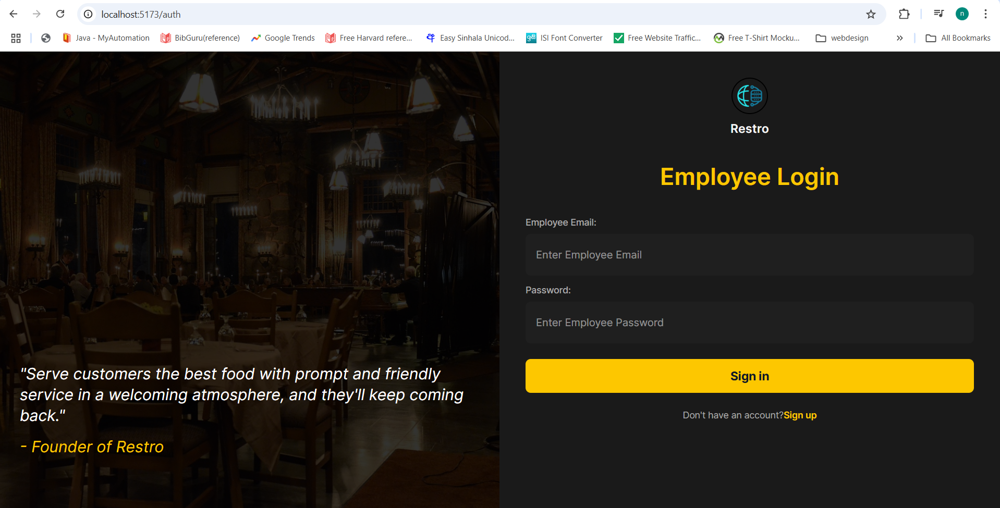
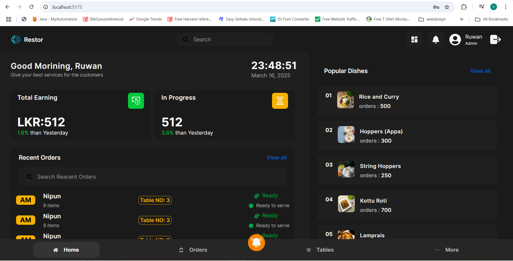

# 🍽️ Restaurant POS System - Frontend

This is the **frontend** of a modern **Restaurant POS System**, built using **React.js, Redux, and Tailwind CSS**. It provides a seamless and intuitive user interface for managing restaurant operations.
---

---
## 🚀 Features

- **User Authentication** (Login & Role-based Access)
- **Dashboard** for restaurant operations
- **Menu Management** (Add, Update, Delete items)
- **Orders Processing** (Create, update, track orders)
- **Table Management** (Assign and manage tables)
- **Dark & Light Theme Toggle**
- **Real-time updates with WebSockets**

---

## 🛠️ Tech Stack

- **Frontend:** React.js, Redux Toolkit
- **State Management:** Redux
- **Styling:** Tailwind CSS
- **API Requests:** Axios
- **Routing:** React Router DOM

---

## Screen Shot
 

 
---

## BackEnd Link: 
- **Link:** https://github.com/nipunaloka/POS-System_MERN_Backend.git
